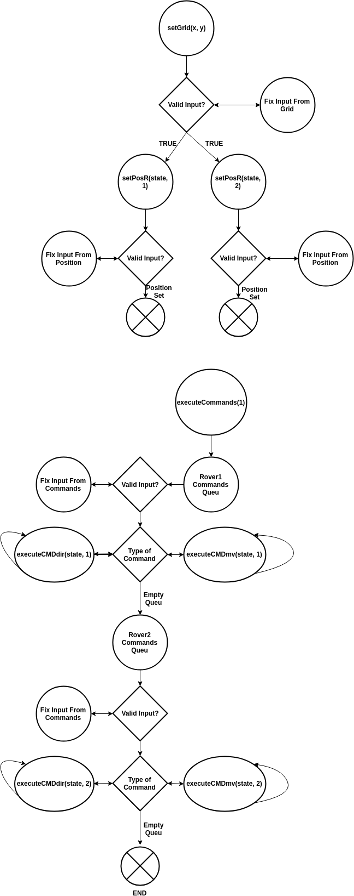
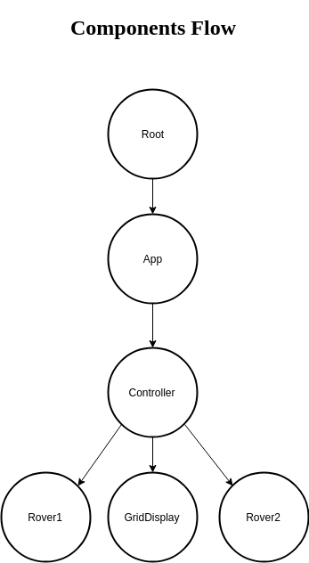

## Mars Rover

This is a project that sets a Grid, initial positioning of two rovers, and the commands for the two rovers. The commands are executed for Rover 1 first, and when the queu of commands are all completed, Rover 2 commands start to be executed. The display of the grid and rovers are optional. The display shows both rovers positioning and direction, along with the proper color to differentiate between Rover 1 and Rover 2. This project uses Redux to keep state from components well organized, and without mutations. Because this program uses Redux, it's very flexible, and new features can be easily added. Currently, it's setup to execute up to 2 sets of commands, Rover 1 is set 1, and Rover 2 is set 2. If desired, another Rover can be added, which will execute set 3. The next component that takes commands doesn't have to be a Rover, it can be anything that will take input for commands to be executed.

### `Components`

The parent component is Root, and it wraps all other components starting with the App component. Inside the App component is where the Controller component is located. The primary component, Controller, contains both Rover1 component, Rover2 component, and the GridDisplay component.

### `Redux Actions`

The redux actions are separated into rover actions and controller actions.  
The controller actions are two in total, **setGrid** which takes x and y integers as parameters, and **executeCommands**, which takes in an integer, corresponding to 1 or 2 (1 is to execute Rover 1 commands).  
The rover actions are three in total:  
**#1 setPosR** takes in a dataObject, and an integer (corresponding to the rover number, such as 1 for Rover1).
 
`const state = {};`  
`// dataOject === state;`  
`state.direction = 90;`  
`state.dir = "N";`  
`state.angle = 90;`  
`state.position = [xCoor, yCoor];`  
`setPosR(state, 1)`    
**#2 executeCMDdir** takes in a dataObject and an integer (corresponding to the rover number, such as 1 for Rover1).  
`const state = { direction: currentDir, dir: "N", angle: 90, commandQueu: split, execute: end };` 
`// dataOject === state;`  
`executeCMDdir(state, 1)`   
**#3 executeCMDmv** takes in a dataObject and an integer (corresponding to the rover number, such as 1 for Rover1).  
`const state = { position: [y, x], commandQueu: split, execute: end };`  
`// dataOject === state;` 
`executeCMDmv(state, 1)` 

### `Redux State`

The redux store has state for Rover1 component, Rover2 component, and Controller component. GridDisplay is a stateless components, and is used to render state from Rover1, Rover2, and Controller. GridDisplay uses the state from other components as props.
Rover1 and Rover2 have identical state naming, but differentiate only by the ending integer on the name. For example, state "position" is Rover 1 state, and "position2" is Rover 2 state.

Rover 1 and Rover 2 initial state:

Rover position

    position: [0, 0]
    position2: [0, 0]

Grid

    xGrids: 0,
    yGrids: 0,

Clockwise angle

    direction: 90,
    direction2: 90,

Counter-clockwise angle
needed for CSS transform

    angle: 90,
    angle2: 90,

Direction as NSEW

    dir: "N",
    dir2: "N",

the queue of commands from input
converted to an array to keep track

    commandQueu: [],
    commandQueu2: [],

The other states are part of Controller or is shared by both Rover1 and Rover2, such as execute.

Grid

    grid: null,

Starts executing when it's not zero

    execute: 0

### `Controller Component State`

description of button, the button only shows when there's a grid and rovers on it

    gridButton: "Show Grid",

the grid dimensions from input

    inputGrid: "",

Display the grid === false by default

    display: false

### `Rover Component States`

Both Rover1 and Rover2 have identical states. Because of React's ES6 class component scope, both components can have state with the exact same name, but their values are independent of each other.

input for the coordinates

      inputCoordinates: "",

When the rover was going out of boundary.
Will stop before going out of boundary

      danger: false,

The message displayed when danger is true

      message: "Rover was going out of boundary, move was prevented",

input for the commands

      inputCommand: ""

### `Rover Component Methods`
// Metods === functions that are part of the class
handleChange:
Method that is in charge of changing the state of inputCommand and inputCoordinates. It detects changes to the input field, and makes the changes to the state according to the name and value of the input field.
 
setCoordinates:
Method that is fired initially by **componentDidUpdate**, after the Controller component fires the **setGrid** action. **setGrid** will update the redux store, and each rover will detect the change through **componentDidUpdate**. The rovers fire **setCoordinates** to set the coordinates, based on logic from **componentDidUpdate**. This method will set the coordinates of each rover, based on the input it received from inputCoordinates state.
 
sendCommands:
Method that is fired initially by  **componentDidUpdate**, after the Controller component fires the **executeCommands** action. **executeCommands** will update the redux store, and each rover will detect the change through **componentDidUpdate**. The rovers fire **sendCommands** to execute the commands from its inputCommand state. Rover1 commands are executed first, and after all commands from Rover1 are completed, then Rover2 will start to execute its commands. The logic to take care of the order is inside of **componentDidUpdate**, so that **componentDidUpdate** will call Rover1 first then Rover2. This method checks the command that needs to be executed. If the command is to change direction, this method will call the action **executeCMDdir**. If the command is to move the rover, then this method will call another method **handleMove**.
 
handleMove:
Method that is fired from **sendCommands** to execute **executeCMDmv** because the command is to move the rover.
 
cancelCommands:
Method that is fired from **componentDidUpdate** to cancel the commands for the current rover. If the commands were supposed to be executed in Rover 1, the commands will be cancelled for Rover 1 and move to Rover 2 commands. This method call the action **executeCommands** with the proper integer to execute commands from the next rover, such as Rover 2. **componentDidUpdate** has the proper logic to check for the component state, and if there are no commands, then **componentDidUpdate** will call **cancelCommands**.
 
componentDidUpdate:
React lifecycle that detects changes to state and props. Redux state is passed into React components as props, because it's not part of the component. This method uses logic based on state from the redux store (as props) and it's own state. Based on the logic, it will fire specific methods in the class.
