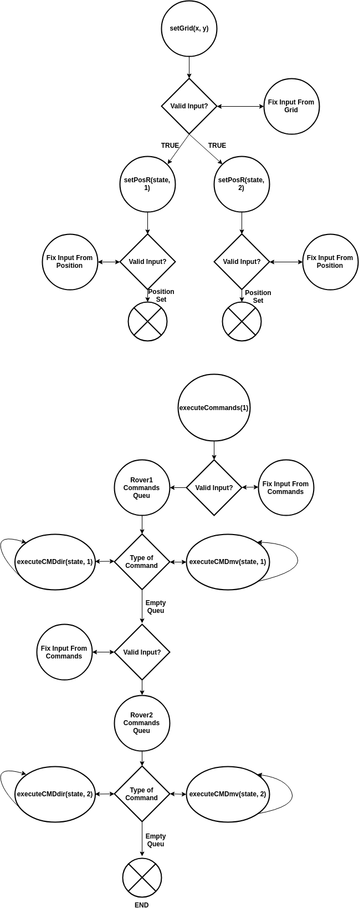

## Mars Rover

This is a project that sets a Grid, initial positioning of two rovers, and the commands for the two rovers. The commands are executed for Rover 1 first, and when the queu of commands are all completed, Rover 2 commands start to be executed. The display of the grid and rovers are optional. The display shows both rovers positioning and direction, along with the proper color to differentiate between Rover 1 and Rover 2. This project uses Redux to keep state from components well organized, and without mutations. Because this program uses Redux, it's very flexible, and new features can be easily added. Currently, it's setup to execute up to 2 sets of commands, Rover 1 is set 1, and Rover 2 is set 2. If desired, another Rover can be added, which will execute set 3. The next component that takes commands doesn't have to be a Rover, it can be anything that will take input for commands to be executed.

### `Components`

The parent component is Root, and it wraps all other components starting with the App component. Inside the App component is where the Controller component is located. The primary component, Controller, contains both Rover1 component, Rover2 component, and the GridDisplay component.

### `Redux Actions`

The redux actions are separated into rover actions and controller actions.
The controller actions are two in total, setGrid which takes x and y integers as parameters, and executeCommands, which takes in a number, corresponding to 1 or 2 (1 is to execute Rover 1 commands).
The rover actions are three in total:
setPosR takes in a dataObject, and an integer (corresponding to the rover number, such as 1 for Rover1).
executeCMDdir takes in a dataObject and an integer (corresponding to the rover number, such as 1 for Rover1).
executeCMDmv takes in a dataObject and an integer (corresponding to the rover number, such as 1 for Rover1).

### `Redux State`

The redux store has state for Rover1 component, Rover2 component, and Controller component. GridDisplay is a stateless components, and is used to use the state from Rover1, Rover2, and Controller.
Rover1 and Rover2 have identical state naming, but differentiate only by the ending integer.

Rover 1 and Rover 2 initial state:

Rover position

    position: [0, 0]
    position2: [0, 0]

Grid

    xGrids: 0
    yGrids: 0

Clockwise angle

    direction: 90
    direction2: 90

Counter-clockwise angle
needed for CSS transform

    angle: 90
    angle2: 90

Direction as NSEW

    dir: "N"
    dir2: "N"

the queue of commands from input
converted to an array to keep track

    commandQueu: []
    commandQueu2: []

The other state is part of Controller or is shared by both Rover1 and Rover2, such as execute.

Grid

    grid: null,

Starts executing when it's not zero

    execute: 0

### `Controller Component State`

description of button

    gridButton: "Show Grid",

the grid dimensions from input

    inputGrid: "",

Display the grid === false by default

    display: false

### `Rover Component States`

Both Rover1 and Rover2 have identical states. Because of React's component scope, both components can have state with the exact same name, but their values are independent of each other.

input for the coordinates

      inputCoordinates: "",

When the rover was going out of boundary.
Will stop before going out of boundary

      danger: false,

input for the commands

      inputCommand: ""
